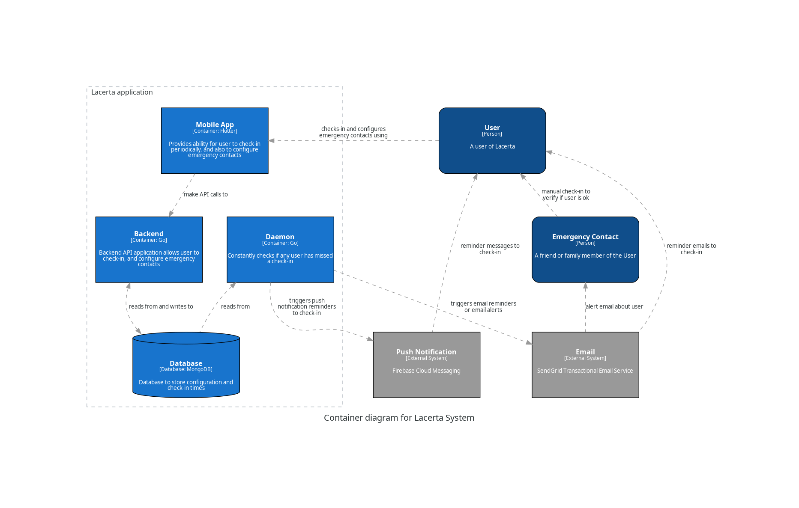

# lacerta

This is a demo project to explain C4 model of architecture documentation.

For more info, see: BLOG_URL_GOES_HERE

## Context Diagram

## Container Diagram

## Python source

These diagrams are generated using Python Diagrams module. Refer to the python source code in the `docs/` folder.
